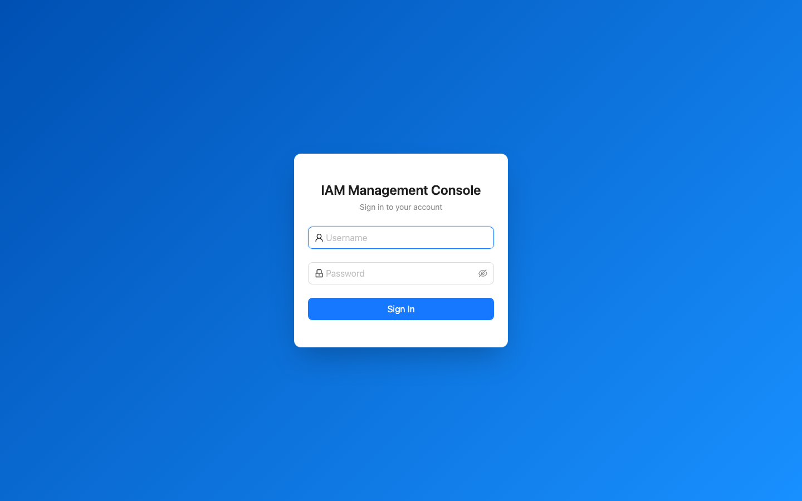
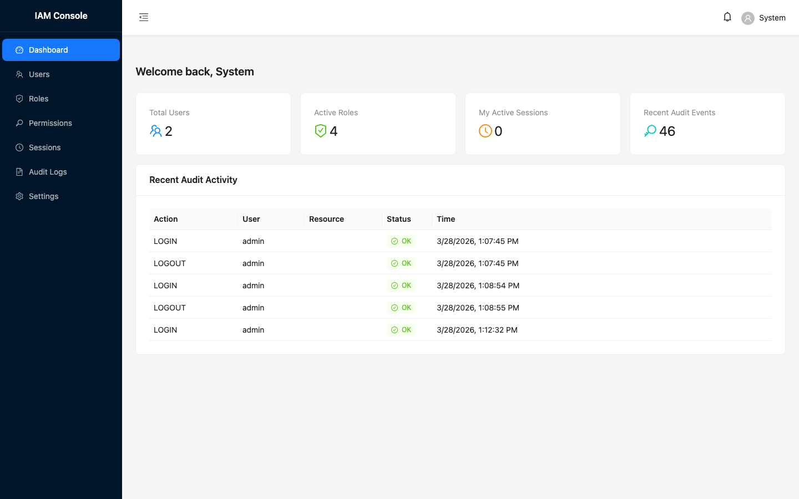
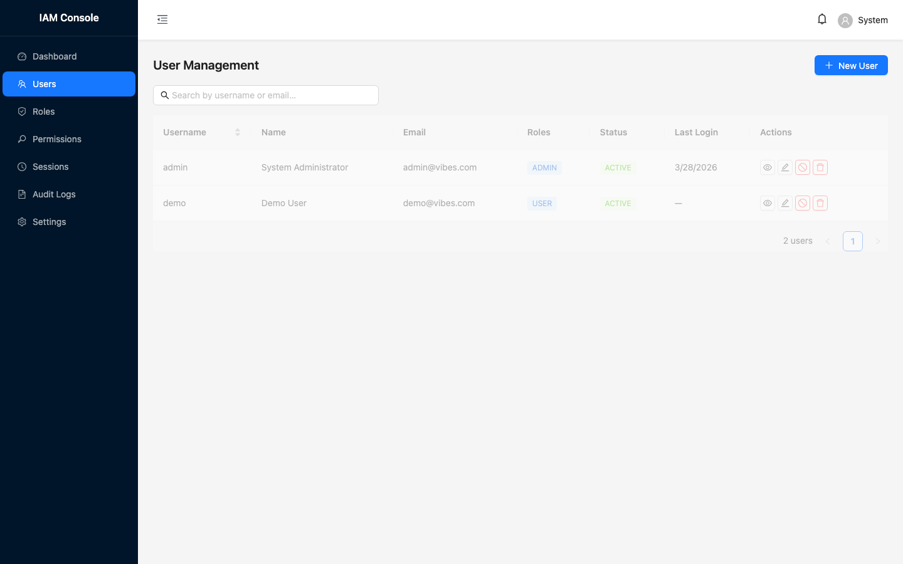
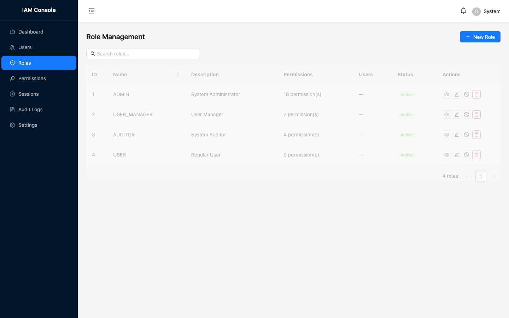
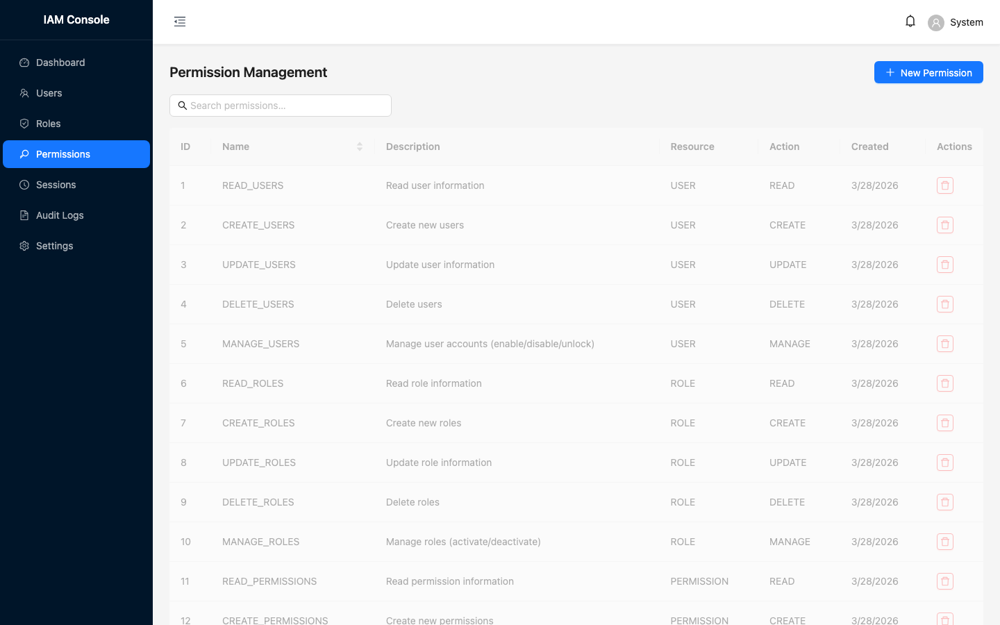
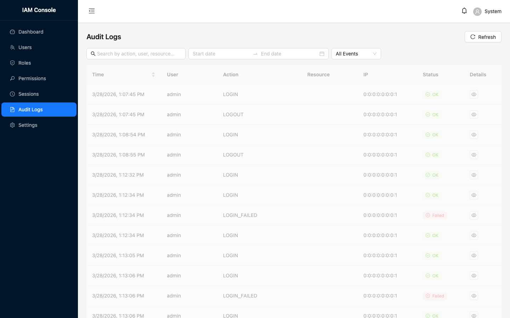
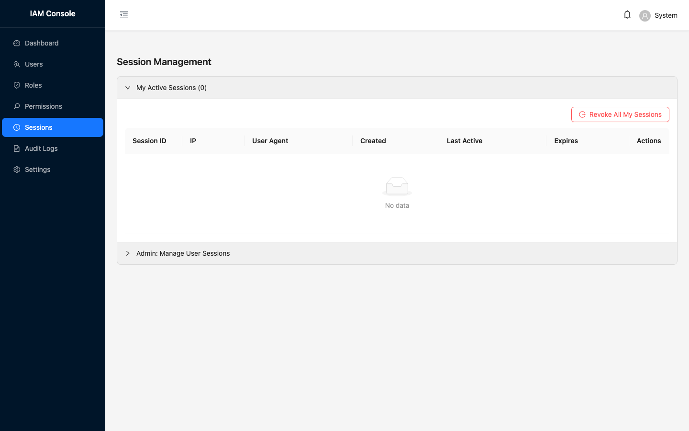
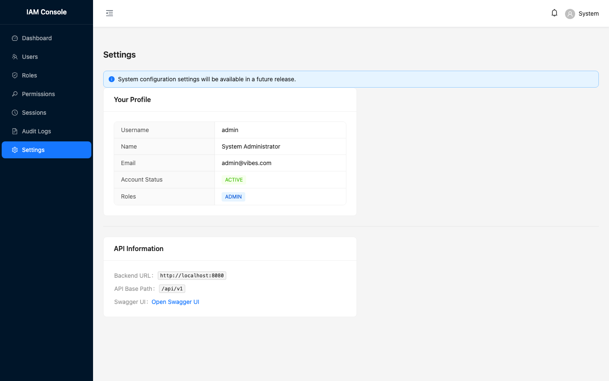

# IAM Server — Identity & Access Management

A full-stack, enterprise-grade IAM platform built with **Spring Boot 3** (backend) and **Next.js 14** (management console). Provides JWT authentication, OAuth2/PKCE, RBAC, session management, rate limiting, and complete audit logging — with a polished UI, Newman API tests (68 requests / 126 assertions), and Playwright E2E tests (78 tests).

[](https://spring.io/projects/spring-boot)
[](https://openjdk.java.net/)
[](https://nextjs.org/)
[](LICENSE)

---

## Screenshots

| Login | Dashboard |
|-------|-----------|
|  |  |

| Users | Roles |
|-------|-------|
|  |  |

| Permissions | Audit Logs |
|-------------|------------|
|  |  |

| Sessions | Settings |
|---------|----------|
|  |  |

---

## Features

### Backend (Spring Boot 3)
- **JWT Authentication** — access + refresh tokens, HS256 signing; refresh token blacklisting on logout
- **OAuth2 Authorization Server** — authorization code, client credentials, PKCE
- **RBAC** — roles with fine-grained permissions
- **Session Management** — multi-device, timeout, concurrent session control
- **Rate Limiting** — Bucket4j per-IP throttle on auth endpoints (configurable)
- **Audit Logging** — complete security event trail
- **Security Headers** — HSTS, CSP, X-Frame-Options, etc.
- **Health & Metrics** — Spring Actuator + Prometheus endpoint (admin-only except `/health`, `/info`)
- **OpenAPI / Swagger UI** — interactive API docs

### Frontend (Next.js 14 + Ant Design)
- **Management Console** — full CRUD for users, roles, permissions
- **Dashboard** — live stats and recent audit activity
- **Session viewer** — inspect and revoke active sessions
- **Responsive** — desktop-first, Ant Design component library
- **Type-safe** — TypeScript throughout, types matched to backend DTOs

---

## Quick Start (local dev)

### Prerequisites
- Java 17+, Maven 3.8+
- Node.js 20+, npm 10+
- Git

### 1 — Start the backend

```bash
cd backend
mvn spring-boot:run
# API:   http://localhost:8080/api/v1
# Docs:  http://localhost:8080/swagger-ui/index.html
```

### 2 — Start the frontend

```bash
cd frontend
npm install
npm run dev
# UI:    http://localhost:3000
```

### Default credentials
| Username | Password   | Role  |
|----------|-----------|-------|
| `admin`  | `Admin@123` | ADMIN |

---

## Docker (recommended)

```bash
cd ops
cp .env.example .env          # fill in JWT_SECRET and passwords
docker compose up -d          # core stack: postgres + backend + frontend
```

| Profile | Extra services |
|---------|---------------|
| `redis` | Redis session store |
| `observability` | Prometheus + Grafana (port 3001) |
| `proxy` | Nginx reverse proxy |
| `full` | everything above |

```bash
# With observability
docker compose --profile observability up -d
```

**Services**

| Service | Port | URL |
|---------|------|-----|
| Frontend | 3000 | http://localhost:3000 |
| Backend API | 8080 | http://localhost:8080/api/v1 |
| Swagger UI | 8080 | http://localhost:8080/swagger-ui/index.html |
| Actuator | 8080 | http://localhost:8080/api/v1/actuator/health |
| Prometheus | 9090 | http://localhost:9090 |
| Grafana | 3001 | http://localhost:3001 |

---

## API Overview

### Authentication
| Method | Path | Description |
|--------|------|-------------|
| POST | `/api/v1/auth/login` | Login — returns access + refresh tokens |
| POST | `/api/v1/auth/refresh` | Refresh access token |
| POST | `/api/v1/auth/logout` | Logout (invalidates session) |

### Users
| Method | Path | Description |
|--------|------|-------------|
| GET | `/api/v1/users` | Paginated user list |
| POST | `/api/v1/users` | Create user |
| GET/PUT/DELETE | `/api/v1/users/{id}` | Get / update / delete |
| POST | `/api/v1/users/{id}/enable` | Enable account |
| POST | `/api/v1/users/{id}/disable` | Disable account |

### Roles & Permissions
| Method | Path | Description |
|--------|------|-------------|
| GET/POST | `/api/v1/roles` | List / create roles |
| GET | `/api/v1/roles/active` | Active roles only |
| GET/POST | `/api/v1/permissions` | List / create permissions |

### Sessions & Audit
| Method | Path | Description |
|--------|------|-------------|
| GET | `/api/v1/sessions/my` | My active sessions |
| DELETE | `/api/v1/sessions/my/{id}` | Revoke session |
| GET | `/api/v1/audit` | Paginated audit log |
| GET | `/api/v1/audit/failed` | Failed-action events only |

Full interactive docs at `/swagger-ui/index.html`.

---

## Testing

### Backend (JUnit + TestContainers)
```bash
cd backend

# Unit + integration tests
mvn test

# TestContainers (requires Docker)
mvn test -Dtest="*TestContainer*"

# Coverage report (target/site/jacoco/index.html)
mvn jacoco:report
```

### API Tests (Newman)
```bash
cd testing/api
npm install

# Run full collection (requires backend on port 8080)
npm test
# 68 requests · 126 assertions · 0 failures ✅

# With HTML report
npm run test:report     # report written to testing/api/reports/
```

### E2E Tests (Playwright)
```bash
cd testing/e2e
npm install
npx playwright install chromium

# All tests  (requires backend on 8080 + frontend on 3000)
npx playwright test --timeout=30000

# UI mode (interactive)
npx playwright test --ui

# Specific test file
npx playwright test tests/ui-login.spec.ts
# 78 tests · 0 failures ✅
```

### Test Status

| Suite | Count | Status |
|-------|-------|--------|
| Backend unit & integration | ~80 | ✅ passing |
| Newman API (Postman) | 68 requests / 126 assertions | ✅ all pass |
| Playwright (API + UI) | 78 tests | ✅ all pass |

---

## Project Structure

```
iam-server/
├── backend/                 Spring Boot application
│   ├── src/main/java/…/iam/
│   │   ├── config/          Security, JPA, OAuth2, OpenAPI config
│   │   ├── controller/      REST controllers
│   │   ├── dto/             Request/response DTOs
│   │   ├── entity/          JPA entities
│   │   ├── security/        JWT, filters, auth providers
│   │   └── service/         Business logic
│   └── Dockerfile           Multi-stage, non-root user
├── frontend/                Next.js 14 management console
│   ├── src/app/             App Router pages
│   ├── src/components/      Shared UI components
│   ├── src/contexts/        Auth context
│   ├── src/lib/             API client, React Query hooks
│   └── src/types/           TypeScript types (mirror backend DTOs)
├── testing/
│   ├── api/                 Postman collection + environments
│   └── e2e/                 Playwright tests (API + UI)
│       └── scripts/         Screenshot capture script
├── ops/
│   ├── docker-compose.yml   Compose with profiles (core / redis / observability / proxy / full)
│   ├── .env.example         Environment template
│   ├── docker/              Nginx (TLS + rate-limit), Prometheus, Grafana configs
│   ├── scripts/             docker-build.sh, k8s-deploy.sh
│   └── k8s/                 Base Kubernetes manifests + Kustomize overlays
│       └── overlays/
│           ├── dev/         1 replica, relaxed resources
│           ├── staging/     2 replicas, moderate resources
│           └── prod/        3 replicas, full HPA, production registry
└── docs/screenshots/        Auto-generated UI screenshots
```

---

## Configuration

### Spring profiles

| Profile | Database | Use case |
|---------|----------|----------|
| `dev` *(default)* | H2 in-memory | Local development — no external dependencies |
| `docker` | PostgreSQL (service name) | Docker Compose runs |
| `prod` | PostgreSQL (env vars required) | Production and Kubernetes |
| `test` | H2 in-memory | Test suite |

```bash
# Run with a specific profile
mvn spring-boot:run -Dspring-boot.run.profiles=dev
SPRING_PROFILES_ACTIVE=prod java -jar backend.jar
```

### Key environment variables

| Variable | Required in | Description |
|----------|------------|-------------|
| `JWT_SECRET` | prod, docker | **Required.** ≥64-char random string |
| `DB_URL` | prod | JDBC URL, e.g. `jdbc:postgresql://host:5432/iam` |
| `DB_USERNAME` | prod | Database username |
| `DB_PASSWORD` | prod, docker | Database password |
| `CORS_ALLOWED_ORIGINS` | prod, docker | Comma-separated allowed origins, e.g. `https://app.example.com` |
| `REDIS_HOST` | docker, prod | Redis host (default: `localhost`) |
| `SPRING_PROFILES_ACTIVE` | docker, k8s | Active Spring profile |

Generate a secure JWT secret:
```bash
openssl rand -base64 64
```

### Rate limiting

Auth endpoints (`/auth/login`, `/auth/refresh`, `/auth/logout`) are throttled per source IP via Bucket4j. Configured per profile:

```yaml
app:
  rate-limiting:
    enabled: true
    capacity: 20           # token bucket size
    refill-tokens: 20      # tokens added per refill
    refill-duration: 60    # refill interval (seconds)
```

Disable for tests: `app.rate-limiting.enabled: false`

### OAuth2 clients (pre-configured)

| Client | Flow | Use case |
|--------|------|----------|
| `iam-web-client` | Authorization Code | Web applications |
| `iam-mobile-client` | Auth Code + PKCE | Mobile apps |
| `iam-service-client` | Client Credentials | Service-to-service |

---

## Kubernetes

### Using k8s-deploy.sh (recommended)

```bash
# Apply to dev cluster
ops/scripts/k8s-deploy.sh -e dev apply

# Apply to staging with a specific image tag
ops/scripts/k8s-deploy.sh -e staging -t v1.2.3 apply

# Apply to production (prompts for confirmation on delete)
ops/scripts/k8s-deploy.sh -e prod -t v1.2.3 apply

# Show status
ops/scripts/k8s-deploy.sh -e prod status

# Roll back to previous deployment
ops/scripts/k8s-deploy.sh -e prod rollback
```

Overlay differences:

| Overlay | Replicas | HPA | Resources |
|---------|---------|-----|-----------|
| `dev` | 1 | ✗ | 256 Mi / 0.5 CPU |
| `staging` | 2–5 | ✓ | 512 Mi / 1 CPU |
| `prod` | 3–10 | ✓ | 1 Gi / 2 CPU |

### Manual apply (base manifests)

```bash
cd ops/k8s
kubectl apply -f namespace.yaml
kubectl apply -f secrets.yaml
kubectl apply -f configmap.yaml
kubectl apply -f postgres.yaml
kubectl apply -f redis.yaml
kubectl apply -f iam-server.yaml
kubectl apply -f hpa.yaml
kubectl apply -f ingress.yaml
```

> **Before deploying**: replace all `REPLACE_ME` values in `ops/k8s/secrets.yaml`.  
> See the comments in that file for Sealed Secrets / External Secrets Operator instructions.

---

## Makefile reference

```bash
make dev-run             # Run backend in dev mode
make test                # Run backend tests
make test-integration    # TestContainers tests
make package             # Build JAR
make docker-build        # Build backend Docker image
make compose-up          # Start docker compose (core)
make compose-down        # Stop docker compose
make compose-logs        # Tail all logs
make k8s-deploy          # Deploy to Kubernetes
make k8s-status          # Show pod/service status
make clean               # Remove build artefacts
```

---

## Security

- Non-root container user in both backend and frontend Dockerfiles
- Secrets supplied via environment variables (never hard-coded)
- Security headers: HSTS, CSP, X-Frame-Options, Referrer-Policy via `SecurityHeadersConfig`
- Actuator: `/health` and `/info` are public; all other actuator endpoints require `ROLE_ADMIN`
- Rate limiting on all auth endpoints (Bucket4j, per source IP)
- Refresh token blacklisting — revoked on logout, checked on every refresh
- Account lockout after 5 failed attempts
- Password policy: min 8 chars, upper + lower + digit + special
- Full audit trail for all authentication and administrative events

---

## Contributing

1. Fork the repository
2. Create a feature branch (`git checkout -b feature/my-feature`)
3. Commit (`git commit -m 'feat: add my feature'`)
4. Push and open a Pull Request

## License

MIT — see [LICENSE](LICENSE).
